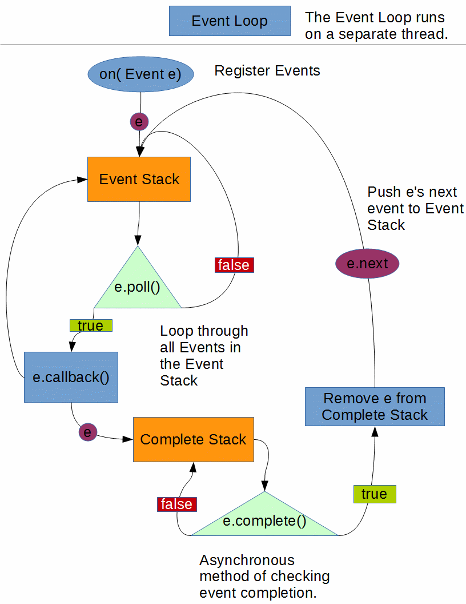

# Sabercat Robotics 2016 Robot Code Documentation

------------

## Features

- Asynchronous Event Loop.
- Intuitive controller wrapper and bindings.
- Custom PID Loop.
- Computer Vision Support.

 ## Planned

- [ ] Auto-tweaking PID.
- [ ] High level sensor feedback abstractions.
- [ ] Event loop meta.
- [ ] High level autonomous abstractions.


------------------

## Controller

### Motivation

The `controller` class is a human-oriented wrapper of the WPI `Joystick` class. It provides methods for accessing the buttons of a *Dual Action Logitech* controller.

 

*Figure 1-1*

### Constructor

`Controller` class contains all of the following function. [Implementation](https://github.com/Sabercat-Robotics-4146-FRC/Robot_Code-2016/blob/master/src/org/usfirst/frc/team4146/robot/Controller.java#L36) [Example](https://github.com/Sabercat-Robotics-4146-FRC/Robot_Code-2016/blob/master/src/org/usfirst/frc/team4146/robot/Robot.java#L36) 

### Methods

**Note:** When referencing *boolean state*, the state is `true` when the button is down, and `false` when the button is up.

```public boolean get_x_button()``` returns the *boolean state* of the X button. (Button 1 in 1-1) [code](https://github.com/Sabercat-Robotics-4146-FRC/Robot_Code-2016/blob/master/src/org/usfirst/frc/team4146/robot/Controller.java#L43)

`public boolean get_a_button()` returns the *boolean state* of the A button. (Button 2 in 1-1) [code](https://github.com/Sabercat-Robotics-4146-FRC/Robot_Code-2016/blob/master/src/org/usfirst/frc/team4146/robot/Controller.java#L50)

`public boolean get_b_button()` returns the *boolean state* of the A button. (Button 3 in 1-1) [code](https://github.com/Sabercat-Robotics-4146-FRC/Robot_Code-2016/blob/master/src/org/usfirst/frc/team4146/robot/Controller.java#L57)

`public boolean get_y_button()` returns the *boolean state* of the A button. (Button 4 in 1-1) [code](https://github.com/Sabercat-Robotics-4146-FRC/Robot_Code-2016/blob/master/src/org/usfirst/frc/team4146/robot/Controller.java#L64)

`public boolean get_left_bumper()` returns the *boolean state* of the left bumber. This button is located above the left trigger. [code](https://github.com/Sabercat-Robotics-4146-FRC/Robot_Code-2016/blob/master/src/org/usfirst/frc/team4146/robot/Controller.java#L71)

`public boolean get_right_bumper()` returns the *boolean state* of the right bumper. This button is located above the right trigger. [code](https://github.com/Sabercat-Robotics-4146-FRC/Robot_Code-2016/blob/master/src/org/usfirst/frc/team4146/robot/Controller.java#L78)

`public boolean get_left_trigger()` returns the *boolean state* of the left trigger. This button is located below the left bumper. [code](https://github.com/Sabercat-Robotics-4146-FRC/Robot_Code-2016/blob/master/src/org/usfirst/frc/team4146/robot/Controller.java#L85)

`public boolean get_right_trigger()` returns the *boolean state* of the right trigger. This button is located below the right bumper. [code](https://github.com/Sabercat-Robotics-4146-FRC/Robot_Code-2016/blob/master/src/org/usfirst/frc/team4146/robot/Controller.java#L92) 

`public boolean get_back_button()` returns the *boolean state* of the back button. This button is located next to the start button. [code](https://github.com/Sabercat-Robotics-4146-FRC/Robot_Code-2016/blob/master/src/org/usfirst/frc/team4146/robot/Controller.java#L99)

`public boolean get_start_button()` returns the *boolean state* of the start button. This button is located next to the back button. [code](https://github.com/Sabercat-Robotics-4146-FRC/Robot_Code-2016/blob/master/src/org/usfirst/frc/team4146/robot/Controller.java#L106)

`public boolean get_left_stick_press()` returns the *boolean state* of the left joystick's button. Active when pressing down on the left stick. [code](https://github.com/Sabercat-Robotics-4146-FRC/Robot_Code-2016/blob/master/src/org/usfirst/frc/team4146/robot/Controller.java#L113)

`public boolean get_right_stick_press()` returns the *boolean state* of the right joystick's button. Active when pressing down on the right stick. [code](https://github.com/Sabercat-Robotics-4146-FRC/Robot_Code-2016/blob/master/src/org/usfirst/frc/team4146/robot/Controller.java#L120)

`public double get_left_x_axis()` returns a `double` that contains the *x-axis position* of the left joystick. [code](https://github.com/Sabercat-Robotics-4146-FRC/Robot_Code-2016/blob/master/src/org/usfirst/frc/team4146/robot/Controller.java#L127)

`public double get_left_y_axis()` returns a `double` that contains the *y-axis position* of the right joystick. [code](https://github.com/Sabercat-Robotics-4146-FRC/Robot_Code-2016/blob/master/src/org/usfirst/frc/team4146/robot/Controller.java#L134)

`public double get_right_x_axis()` returns a  `double` that contains the *x-axis position* of the right joystick. [code](https://github.com/Sabercat-Robotics-4146-FRC/Robot_Code-2016/blob/master/src/org/usfirst/frc/team4146/robot/Controller.java#L141)

`public double get_right_y_axis()`  returns a `double` that contains the *y-axis position* of the right joystick. [code](https://github.com/Sabercat-Robotics-4146-FRC/Robot_Code-2016/blob/master/src/org/usfirst/frc/team4146/robot/Controller.java#L148)

`public Vector2d get_right_axis()` returns a `Vector2d` (two dimensional vector) containing the axes of the right stick. [code](https://github.com/Sabercat-Robotics-4146-FRC/Robot_Code-2016/blob/master/src/org/usfirst/frc/team4146/robot/Controller.java#L155)

`public Vector2d get_left_axis()` returns a `Vector2d` (two dimensional vector) containing the axes of the right stick. [code](https://github.com/Sabercat-Robotics-4146-FRC/Robot_Code-2016/blob/master/src/org/usfirst/frc/team4146/robot/Controller.java#L162)

`public Joystick get_joystick()` returns the `Joystick` object that the `Controller` class wraps around. [code](https://github.com/Sabercat-Robotics-4146-FRC/Robot_Code-2016/blob/master/src/org/usfirst/frc/team4146/robot/Controller.java#L170)

`public Event bind( int button )` returns an `Event` which is triggered when the parameterized button, is presses. The `Event` is then completed when the button is released. This means that the `EventLoop` will only receive one of this event's chains. This is a best-practice method of binding buttons. [code]()

----------------------------

## Event Loop



*Figure 1-2*

###  Motivation

Event loop architecture usually used in user interfaces and control schemes. This use is just the surface of the model's glory. The `EventLoop` acts as a operations manager for the robot. The loop is designed around being instantiated in a seperate thread for speed and efficiency. The loop allows us to bind complex actions that chain events that require completion credentials. Although the code is very simple, you don't need to know how it works under the hood. You should just have a general understanding of how what the code accomplishes not nececaraly how it accomplishes it. If you wish to implement the model in your own code, you should also understand how to use the `EventLoop` in conjunction with `Events`. You may also find it useful to extend the `Event` class for custom and pretty events. 

Firstly, you should understand what the `EventLoop` acomplishes. When explaining the motive behind implementing the event loop, I like to pull the analogy of how people explain the robot's function in engish. "**When** the trigger is pulled, lift the shooter arm. **Then, when** the shooter arm reaches the top, spin the motor **until** it reaches 2500 encoder rate. **Then**, drop the lifter arm." This is a common way of expressing how the robot works. It is the most natural way of explaining the *logic* of the robot. Although the `EventLoop` uses some more technical language, it is essentially a way for engineers to write software in this *When, Until, Then* logic. Although the diagram may look complicated, all it does is express the internals of the code.

Firstly, We need to introduce the `Event`: the workhorse of the `EventLoop`. An event is just as it may sound in English, something that happens. Think of the `Event` happening **when** its `poll` function returns `true`. In the example above, the poll would `return true` when the left trigger is pressed. The `Event`'s `callback` is what you want to happen **when** the event happens. In our example, the callback would activate the motor that controls the shooter arm. The `Event`'s `complete` function just defines when the event is completed. For our example, the completion function would return the state of the upper limit switch of the arm. This is the general idea of the loop. In practice, it is slightly more complex because of safety and sake of modularity. Check out the actual [shooter implementation](https://github.com/Sabercat-Robotics-4146-FRC/Robot_Code-2016/blob/master/src/org/usfirst/frc/team4146/robot/Shooter.java#L50).

`Event`s can also be "chained" this is just the fancy way of saying that the event has a *then* statement. The *then* just means that when the event is completed, i.e. the event's `complete` function returns `true`, another event will be polled that was not previously on the "stack." This means that you can have the flywheel spin-up event execute right after the arm is lifted. Normally, the fly wheel event would need a state machine with `enums` and such. With the event loop, the context of the shooter is not explicit, it is implicit because it is broken down into a natural abstraction. If more complicated states arise, instead of piling on `enums` and state machines, try forking the event loop and adding some *meta-event monitoring*. In most robotics applications, the event loop is perfect for complex system programming. 

### Constructor

 `EventLoop` (extends Runnable) should be deployed in a separate thread. `(new Thread( main_event_loop )).start();` The `EventLoop` also needs to have the `Event`s that it handles to be registered under itself. If you have an `Event e`, then the proper syntax for registering this event to `EventLoop main_event_loop` is as follows: `main_event_loop.on( e );` [code](https://github.com/Sabercat-Robotics-4146-FRC/Robot_Code-2016/blob/master/src/org/usfirst/frc/team4146/robot/EventLoop.java#L19)

### Methods

`public void on( Event e )` Takes a new `Event`, e, and adds it to the stack of events to look out for. This specific stack does not die, it persists even when the event is done. This is ideal for binding buttons. [code](https://github.com/Sabercat-Robotics-4146-FRC/Robot_Code-2016/blob/master/src/org/usfirst/frc/team4146/robot/EventLoop.java#L28)

`public void run()` Just used for the thread. Take a look in the code if you're interested. [code](https://github.com/Sabercat-Robotics-4146-FRC/Robot_Code-2016/blob/master/src/org/usfirst/frc/team4146/robot/EventLoop.java#L28)

----------

## Event

### Motivation

Provides an efficient, high level abstraction for system design. See `EventLoop`

### Constructor

`public Event ( attr e )` Takes a parameter `attr` e. The `attr` stands for attribute which is just an interface for event functions. [code](https://github.com/Sabercat-Robotics-4146-FRC/Robot_Code-2016/blob/master/src/org/usfirst/frc/team4146/robot/Event.java#L13)

### Methods

`public boolean poll()` Just wrapped the `Events` `attr's` `poll` function. [code](https://github.com/Sabercat-Robotics-4146-FRC/Robot_Code-2016/blob/master/src/org/usfirst/frc/team4146/robot/Event.java#L18)

`public void callback()` Just wrapped the `Events` `attr's` `callback` function. [code](https://github.com/Sabercat-Robotics-4146-FRC/Robot_Code-2016/blob/master/src/org/usfirst/frc/team4146/robot/Event.java#L19)

`public boolean complete()` Just wrapped the `Events` `attr's` `complete` function. [code](https://github.com/Sabercat-Robotics-4146-FRC/Robot_Code-2016/blob/master/src/org/usfirst/frc/team4146/robot/Event.java#L20)

`public Event then(Event e)` Makes the event have an event to add to the stack when the event is completed. This function  returns the same event that was passed, but it now is a member of the event. [code](https://github.com/Sabercat-Robotics-4146-FRC/Robot_Code-2016/blob/master/src/org/usfirst/frc/team4146/robot/Event.java#L26)

`public Event clone()` Spawns an *evil* clone of the event. [code](https://github.com/Sabercat-Robotics-4146-FRC/Robot_Code-2016/blob/master/src/org/usfirst/frc/team4146/robot/Event.java#L32)

---------------------------

## attr (interface)

### Motivation

The `attr` interface allows functions to be passes as an argument for the `Event` constructor. This allows you to define the `poll`, `callback`, and `complete` functions on the fly when constructing new `Event`s.

### Constructor

For syntactic glory, I tend to just construct an `Event`'s `attr` in the `Event`'s constructor. This just saves space and is easier to read. [code](https://github.com/Sabercat-Robotics-4146-FRC/Robot_Code-2016/blob/master/src/org/usfirst/frc/team4146/robot/attr.java#L7)

``` java 
Event e = new Event( new attr() {
	public boolean poll(){
    	// Check to see if the event is happening.
    	return /*weather the event is happening*/ false;
	} 
    public void callback(){
    	// Define what should happen when the event is triggered.
    }
    public boolean complete(){
    	// Check weather the event's completion criteria have been met.
    	return false;
    }
});
```

You can also define the `Event`'s attribute before constructing the event. 

``` java 
attr attribute = new attr() {
	public boolean poll(){
    	// Check to see if the event is happening.
    	return /*weather the event is happening*/ false;
	} 
    public void callback(){
    	// Define what should happen when the event is triggered.
    }
    public boolean complete(){
    	// Check weather the event's completion criteria have been met.
    	return false;
    }
}
Event e = new Event( attribute );
```

### Methods

`boolean poll()` defines the poll function of an object. When this function returns `true`, the event will trigger and execute the callback function. [code](https://github.com/Sabercat-Robotics-4146-FRC/Robot_Code-2016/blob/master/src/org/usfirst/frc/team4146/robot/attr.java#L8)

`void callback()` defines the behavior of the event when it is triggered. When the poll function returns `true`, this function will be called. [code](https://github.com/Sabercat-Robotics-4146-FRC/Robot_Code-2016/blob/master/src/org/usfirst/frc/team4146/robot/attr.java#L9)

`boolean complete()` defines the completion criteria for the given event. This will be pushed to the event `stack` when an event is polled and the callback is called. The callback will cease to be called when this function returns `true`. [code](https://github.com/Sabercat-Robotics-4146-FRC/Robot_Code-2016/blob/master/src/org/usfirst/frc/team4146/robot/attr.java#L10)

----------------------------

##  AsyncLoop

### Motivation

The `AsyncLoop` class is an extension of the `Event` class. It is used for utilizing the `EventLoop` as an *"asynchronous"* while loop. The class allows you to register functions to execute as an `Event` in the `EventLoop`. 

### Constructor

This is a cut and dry object declaration with a `function` argument. 

``` java 
AsyncLoop loop = new AsyncLoop( new function() {
	public static void fn() {
      // Do something each itteration of the EventLoop
	}
});
main_event_loop.on( loop );
```

 [code](https://github.com/Sabercat-Robotics-4146-FRC/Robot_Code-2016/blob/master/src/org/usfirst/frc/team4146/robot/AsyncLoop.java#L5)

### Methods

All of the `Event` methods apply to this class.

-----------------

## function (interface)

### Motivation

This interface is used as a general purpose `void` functions for constructing objects with custom function behavior. It is currently used in `AsyncLoop`s, but are purposely vague and versatile.  

### Constructor

The `function` interface has a painless construction. [code](https://github.com/Sabercat-Robotics-4146-FRC/Robot_Code-2016/blob/master/src/org/usfirst/frc/team4146/robot/function.java#L3)

``` java 
function f = new function() {
	public void fn(){
    	// Do stuff.
	}
};
/* If you want to use it in an AsyncLoop, */
AsyncLoop loop = new AsyncLoop( f );
```

### Methods

The `function` interface only has one method to be declared,

`public void fn()` is the function that will run when `function_instance_name.fn();` is called. [code](https://github.com/Sabercat-Robotics-4146-FRC/Robot_Code-2016/blob/master/src/org/usfirst/frc/team4146/robot/function.java#L4)

-------------------

More documentation to come...